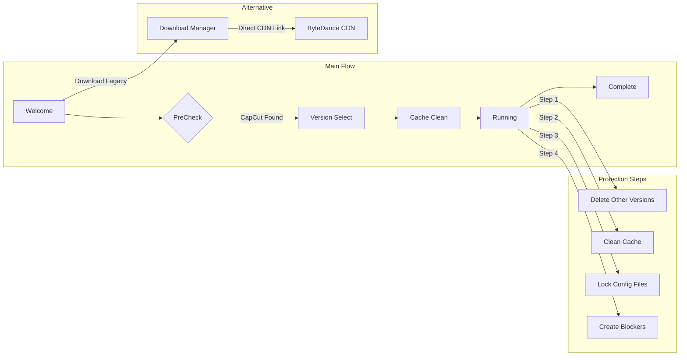

<div align="center">

# 🛡️ CC Version Guard (Tauri)

**Take control of your CapCut version. Lock your preferred release and block unwanted auto-updates.**

[](https://www.rust-lang.org/)
[](https://tauri.app/)
[](https://www.microsoft.com/windows)
[](LICENSE)
[](https://mcaf.managed-code.com/)

[Download](#-quick-start) • [Features](#-features) • [How It Works](#-how-it-works) • [Build](#-building-from-source) • [Documentation](#-documentation)

</div>

---

## 🎯 The Problem

Automatic updates frequently:
- Remove features (free Auto-Captions → paid subscription)
- Add paywalls to previously free exports
- Increase cloud dependency and telemetry
- Break workflows by changing the UI

**You shouldn't be forced to update software you already own.**

---

## ✨ Features

| Feature | Description |
|---------|-------------|
| **Version Detection** | Automatically scans your system for all installed CapCut versions |
| **Version Selection** | Choose exactly which version to keep — the rest are safely removed |
| **Download Manager** | Direct downloads from official ByteDance CDN with 6 curated legacy versions |
| **Cache Cleaner** | Clean up CapCut cache to free disk space and ensure fresh installation |
| **Update Blocking** | Locks configuration files and creates blocker files to prevent auto-updates |
| **Guided Wizard** | Step-by-step flow — no technical knowledge required |

### Persona-Based Version Recommendations

| Persona | Version | Best For |
|---------|---------|----------|
| 🖥️ **Offline Purist** | 1.5.0 | Clean UI, unrestricted 4K export, zero cloud dependency |
| 🔊 **Audio Engineer** | 2.5.4 | Multi-track audio editing, stable mixer, keyframe support |
| 🎬 **Classic Pro** | 2.9.0 | Maximum free features, legacy UI, stable performance |
| ⚖️ **Modern Stable** | 3.2.0 | Good balance of modern features vs paywalls |
| ✨ **Creator** | 3.9.0 | Last version with free Auto-Captions (High Risk) |
| ⚡ **Power User** | 4.0.0 | Track height adjustment, markers (Stricter Paywall) |

---

## 🚀 Quick Start

### Option 1: Download Release
1. Download `CC Version Guard.exe` from [Releases](https://github.com/Zendevve/capcut-version-guard/releases)
2. Run the executable
3. Follow the wizard

> **⚠️ Windows SmartScreen Warning**
>
> You may see "Windows protected your PC" when running. This is normal for unsigned executables.
>
> **To run anyway:**
> 1. Click **"More info"**
> 2. Click **"Run anyway"**
>
> The app is open-source — [inspect the code yourself](src-tauri/src/) if you're concerned.

### Option 2: Build from Source
```bash
git clone https://github.com/Zendevve/capcut-version-guard.git
cd capcut-version-guard/capcut_guard_tauri
npm install
npm run tauri build
```

The binary will be at `src-tauri/target/release/capcut_guard_tauri.exe`

---

## 🔧 How It Works



### Protection Mechanisms

1. **Version Cleanup** — Removes all versions except your selected one from `%LOCALAPPDATA%\CapCut\Apps\`
2. **Cache Cleaning** — Optionally clears CapCut cache to free disk space
3. **Config Locking** — Sets critical configuration files to read-only
4. **Blocker Files** — Creates backup files (`updater.exe.bak`) that prevent the updater from running

---

## 🏗️ Architecture

### Tech Stack

| Technology | Purpose |
|-----------|---------|
| **Tauri v2** | Cross-platform desktop framework |
| **Rust 2021** | Memory-safe backend logic |
| **Vanilla JS** | Lightweight frontend (no framework) |
| **Phosphor Icons** | Professional icon set |
| **sysinfo** | Process detection |
| **walkdir** | Directory traversal |

### Project Structure

```
capcut_guard_tauri/
├── src/                         # Frontend
│   ├── index.html              # All wizard screens
│   ├── styles.css              # Design system
│   ├── main.js                 # App logic & IPC
│   └── assets/
├── src-tauri/                   # Backend
│   ├── src/
│   │   ├── main.rs             # Entry point
│   │   ├── lib.rs              # Command registration
│   │   └── commands/           # Modular commands
│   │       ├── scanner.rs      # Version scanning
│   │       ├── process.rs      # Process detection
│   │       ├── cleaner.rs      # Cache cleaning
│   │       └── protector.rs    # File locking
│   ├── Cargo.toml
│   └── tauri.conf.json
├── AGENTS.md
├── package.json
└── README.md
```

### Design Decisions
- **Universal Interface (HIG)**: strict adherence to Apple's Human Interface Guidelines (Clarity, Deference, Depth) to ensure a premium, native feel across platforms.
- **Tauri**: Chosen for small bundle size and native WebView capabilities.
- **Vanilla JS**: No framework overhead needed for this simple wizard logic.fast
- **Modular Rust** — Each feature in its own file for maintainability
- **Universal Interface (HIG)** — Strict adherence to Apple's Human Interface Guidelines (Clarity, Deference, Depth)

---

## 📖 Documentation

| Document | Description |
|----------|-------------|
| [AGENTS.md](AGENTS.md) | AI coding rules and project conventions |
| [Version Protection](../capcut_guard_rust/docs/Features/version-protection.md) | Core feature specification |
| [Download Manager](../capcut_guard_rust/docs/Features/download-manager.md) | Legacy version download flow |

---

## 🛠️ Building from Source

### Prerequisites
- [Rust](https://rustup.rs/) 1.70 or later
- [Node.js](https://nodejs.org/) 18 or later
- Windows 10/11

### Commands

```bash
# Install dependencies
npm install

# Run in development mode
npm run tauri dev

# Build optimized release
npm run tauri build

# Format Rust code
cd src-tauri && cargo fmt

# Lint Rust code
cd src-tauri && cargo clippy
```

---

## 🤝 Contributing

This project follows [MCAF](https://mcaf.managed-code.com/) (Managed Code AI Framework).

Before contributing:
1. Read [AGENTS.md](AGENTS.md)
2. Check existing docs for context
3. Follow the coding rules and UI preferences documented there

---

## ⚠️ Disclaimer

This tool modifies files in your CapCut installation directory. While it's designed to be safe:
- **Back up your projects** before running
- Use at your own risk
- Not affiliated with ByteDance or CapCut

---

## 💬 A Note from the Developer

Hey! I'm a college student building this in my free time as a hobby project — and hopefully a portfolio piece to land my first dev job.

**Why the SmartScreen warning?** Code signing certificates cost $200-400/year, which is... a lot when you're living on instant noodles. The app is fully open-source, so you can [read every line of code](src-tauri/src/) before running it.

If you find this useful:
- ⭐ **Star the repo** — it helps with visibility
- 🐛 **Report bugs** — I actually fix them
- 💼 **Hiring?** — [Let's talk](https://github.com/Zendevve)

---

## 📄 License

MIT © [Zendevve](https://github.com/Zendevve)

---

<div align="center">

**Built with Tauri 🦀 and a whole lot of depression**

*Made with love by a broke college student who just wants to help people keep their software.*

</div>
