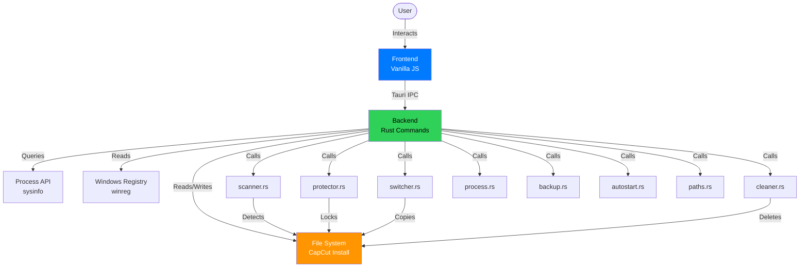
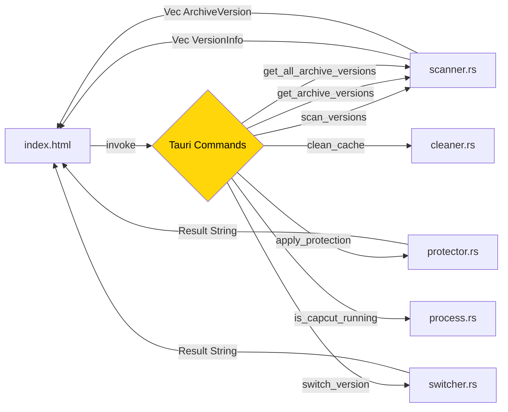
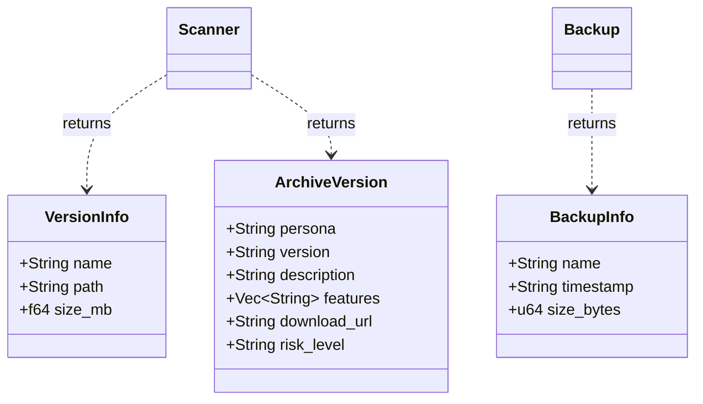

# Architecture Overview

**Project:** CC Version Guard
**Last Updated:** 2026-01-05
**Owner:** Zendevve

---

## Scoping (read first)

**Navigation strategy for AI agents:**
1. Start here → get module map + dependency rules
2. Use diagram links to jump to specific Features/ADRs/code
3. Follow "Modules" table  to find entry points (no repo-wide scanning)

**This doc is the map, not the inventory:**
- Shows boundaries,modules, and how they connect
- Links to deeper docs (ADRs, Features)
- Captures key architectural invariants

---

## Summary

CC Version Guard is a **Tauri v2 desktop application** for Windows that manages CapCut version installations. It uses:
- **Rust backend** (Tauri commands) for file system operations, process detection, version scanning
- **Vanilla JS frontend** (no framework) for wizard-style GUI
- **macOS Tahoe design system** (`design.json`) for UI theming

**Core responsibility:** Prevent CapCut auto-updates by locking installation files, allowing users to stay on preferred versions.

---

## System/Module Map

---

## Interfaces/Contracts Map

---

## Key Classes/Types Map

---

## Modules

| Module | Responsibility | Depends On | Entry Points |
|--------|---------------|------------|--------------|
| **Frontend** | Wizard UI, Tauri IPC | Backend commands | [`index.html`](file:///d:/COMPROG/capcut%20disable%20auto%20updater/capcut_guard_tauri/src/index.html), [`main.js`](file:///d:/COMPROG/capcut%20disable%20auto%20updater/capcut_guard_tauri/src/main.js) |
| **scanner.rs** | Detect installed versions, provide legacy download links | `paths.rs` | `scan_versions()`, `get_archive_versions()`, `get_all_archive_versions()` |
| **protector.rs** | Lock files to prevent auto-update | `paths.rs`, `process.rs` | `apply_protection()`, `check_protection_status()` |
| **switcher.rs** | Copy version folders to switch between versions | `paths.rs`, `backup.rs` | `switch_version()` |
| **cleaner.rs** | Delete cache/temp files | `paths.rs` | `clean_cache()`, `calculate_cache_size()` |
| **process.rs** | Detect if CapCut is running | `sysinfo` crate | `is_capcut_running()`, `perform_precheck()` |
| **backup.rs** | Create/restore version backups | `paths.rs` | `create_backup()`, `restore_version_backup()` |
| **autostart.rs** | Manage Windows startup registry | `winreg` crate | `get_autostart_enabled()`, `set_autostart_enabled()` |
| **paths.rs** | Resolve CapCut install paths | Registry, env vars | `get_capcut_root_path()`, `get_capcut_apps_path()` |

---

## Dependency Rules

### Allowed
- Frontend MAY call ANY backend command via Tauri IPC
- Backend commands MAY import `paths.rs` (shared utility)
- Commands MAY use external crates (`sysinfo`, `winreg`, `walkdir`)
- Frontend MAY use CDN resources (Phosphor Icons)

### Forbidden
- Backend commands MUST NOT call each other directly (use composition if needed)
- Frontend MUST NOT access file system (always go through Tauri commands)
- NEVER bundle CapCut binaries (only external links)
- NEVER use Node.js dependencies (frontend is pure browser JS)

### Integration
- **Frontend ↔ Backend**: Tauri IPC (`invoke()`, serialized via serde)
- **Backend ↔ File System**: Rust std::fs + walkdir
- **Backend ↔ Registry**: winreg crate (Windows only)

---

## Key Decisions (ADRs)

- [**ADR-001: GUI Framework**](file:///d:/COMPROG/capcut%20disable%20auto%20updater/capcut_guard_tauri/docs/ADR/001-gui-framework.md) - Why Tauri v2 + Vanilla JS
- [**ADR-002: Wizard UX**](file:///d:/COMPROG/capcut%20disable%20auto%20updater/capcut_guard_tauri/docs/ADR/002-wizard-ux.md) - Why wizard flow over dashboard
- [**ADR-003: Laws of offUX**](file:///d:/COMPROG/capcut%20disable%20auto%20updater/capcut_guard_tauri/docs/ADR/003-laws-of-ux.md) - UX psychology framework

---

## Links to Features

- [**Version Protection**](file:///d:/COMPROG/capcut%20disable%20auto%20updater/capcut_guard_tauri/docs/Features/version-protection.md) - Core file locking mechanism
- [**Download Manager**](file:///d:/COMPROG/capcut%20disable%20auto%20updater/capcut_guard_tauri/docs/Features/download-manager.md) - Legacy version downloads (persona view)
- [**Legacy Downloads**](file:///d:/COMPROG/capcut%20disable%20auto%20updater/capcut_guard_tauri/docs/Features/legacy-downloads.md) - Complete version database (backend ready)

---

## Testing/Development

- [**Testing Strategy**](file:///d:/COMPROG/capcut%20disable%20auto%20updater/capcut_guard_tauri/docs/Testing/strategy.md)
- [**Development Setup**](file:///d:/COMPROG/capcut%20disable%20auto%20updater/capcut_guard_tauri/docs/Development/setup.md)

---

## Architectural Invariants

These MUST remain true across all changes:

1. **MUST: No CapCut distribution** - We only provide *links* to official ByteDance servers
2. **MUST: Frontend is pure browser** - No Node.js runtime, no npm modules at runtime
3. **MUST: Commands are stateless** - Each Tauri command is independent, no shared backend state
4. **MUST: File operations are safe** - Always check if CapCut is running before modifying files
5. **MUST: Paths are validated** - Use `paths.rs` to resolve CapCut location, never hardcode
6. **MUST: Errors surfaced to UI** - Backend returns `Result`, frontend shows user-friendly errors

---

## How to Read This Doc

**For new engineers:**
1. Read Summary + System/Module Map
2. Follow links to ADRs for key decisions
3. Check Features for behavior details
4. Use Modules table to find relevant code

**For AI agents:**
1. Use this as navigation index (avoid scanning entire repo)
2. Diagram links → specific docs/code
3. Respect Dependency Rules
4. Update this doc when boundaries change
